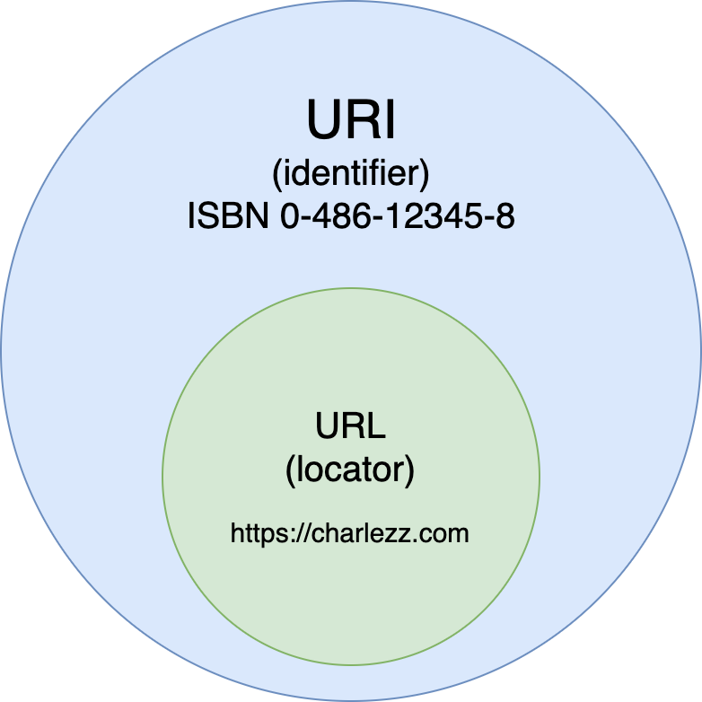

# HTTP란?

**H**yper**t**ex**t** **P**rotocol
: 서버 -  클라이언트 메세지 교환 프로토콜

- 프로토콜 : 서로 다른 하드웨어 기기 간 데이터 통신 규약

## 기기 간 통신 과정

TCP/IP 4계층을 기준으로 나누면,

### 클라이언트 

HTTP - TCP - IP - 네트워크

### 서버 
HTTP - TCP - IP - 네트워크

## TCP란?
전송 제어 프로토콜(Transmission Control Protocol)은 인터넷 프로토콜 스위트(IP)의 핵심 프로토콜 중 하나로, IP와 함께 TCP/IP라는 명칭으로도 널리 불립니다.

주로 서버와 클라이언트간에 데이터를 신뢰성 있게 전달하기 위해 사용합니다.

### TCP 특징

1. 신뢰성있는 데이터 통신을 가능하게 함

2. 양방향 통신 (3, 4 way handshake)
- TCP 3 Way Handshake : TCP/IP프로토콜을 이용해서 통신을 하는 응용프로그램이 데이터를 전송하기 전에 먼저 정확한 전송을 보장하기 위해 상대방 컴퓨터와 사전에 세션을 수립하는 과정을 의미한다.
  
Client > Server : TCP SYN     ("내 목소리 들려?") 
Server > Client : TCP SYN ACK.  ("응 들려")   
Client > Server : TCP ACK("나도 잘 들려")

 SYN은 'synchronize sequence numbers'  
 ACK는'acknowledgment'

4. 순차 전송을 보장
- TCP는 바이트 스트림 형태로 데이터를 송-수신한다.

*바이트 스트림 (Byte Stream) 이란?

한번에 한 바이트씩 연속적으로 전송되는 데이터의 흐름과 같이 끊임없이 연속되는 바이트 열. 

## IP란?
IP(Internet Protocol)는
컴퓨터와 컴퓨터간에 데이터를 전송하기 위해서, 각 컴퓨터의 주소가 필요하다. Internet Protocol은 4바이트로 이루어진 컴퓨터의 주소이며, 192.168.9.255와 같이 3개의 마침표로 나뉘어진 숫자로 표시된다. IP는 TCP와는 달리 데이터의 재조합이나 손실여부 확인이 불가능하며, 단지 데이터를 전달하는 역할만을 담당한다.

IP는 컴퓨터 주소가 아니라 LAN Card(NIC, Network Interface Card)에 연결되어 있는 회선(랜선)의 주소를 말한다. (고정되어 있는 것이 아니라 인터넷망에 접속할 때마다 달라짐)

참고로 IP주소는 하드웨어 고유의 식별번호인 MAC주소와 다르게 임시적으로 다른 주체(통신사)에게 받는 주소이므로, 바뀔수 있다.

+ MAC주소

네트워크 상에서 서로를 구분하기 위하여 Device 마다 할당된 물리적인 주소를 말한다. 인터넷이 가능한 장비(PC, 휴대폰 등)들이 가지고 있는 물리적인 주소라고 생각하면 된다. (고정되어 있는 거라 특별한 조작이 없으면 달라지지 않음)

- IP와 MAC주소의 차이

IP 주소 : 라우팅을 하기 위해 사용
MAC 주소 : 이더넷을 이용하기 위해 사용

* MAC 주소로만 통신하면 안 될까?
  
집에서 naver.com의 웹 서버를 찾는다고 가정하면, ISP내의 모든 라우터들은 전세계 모든 서버들의 MAC 주소를 다 가지고 있어야 한다. 즉, 하나하나 MAC 주소에 대해 라우팅 해줘야 한다.(불가능) 하지만 IP 주소 체계는 변경 가능하고, 라우팅하는 데 효과적이다. 

(결론 : MAC 주소는 하드웨어 고유 주소이고 대부분 변경하지 않음, 외우기도 힘듦, 라우팅 힘듦)
 
* 예시 1

사람의 주민등록번호는 MAC 주소, 사람의 이름은 MAC 주소에 매핑되는 IP 주소, 그 사람의 별명은 IP 주소와 매핑되는 호스트 이름이라고 생각해보자.
 
우리는 일상에서 누군가를 지목할 때 그의 주민등록번호를 부르지는 않는다. 불편하고 외우기도 어려움. 그래서 성과 이름을 사용한다. 하지만 이름도 외우기 어렵다. 길가다가 동창생을 만나면 이름은 기억안나고 별명만 기억나는 경우가 있다. 그만큼 별명이라는 호칭이 더 표현하기 쉽고 외우기도 쉽다. 이 관계를 TCP/IP 구조로 생각하자면
 
주민등록번호 : 03XXXX-XXXXXXX <-------> MAC : 00-0C-29-00-11-22
이름 : 홍길동 <-------> IP : 1.1.1.1
별명 : 네이버 <-------> DNS : www.naver.com

### ARP

ARP 프로토콜은 같은 네트워크 대역에서 통신을 하기 위해 필요한 MAC 주소를 IP 주소를 이용해서 알려주는 프로토콜이다.
따라서 IP 주소만 입력해도 ARP 프로토콜이 상대방의 MAC 주소를 알아오고, 같은 네트워크 대역에서 MAC 주소를 이용해 통신을 하게 된다.

### DNS

DNS(Domain Name System)는 IP 네트워크에서 사용하는 시스템이다. 우리가 인터넷을 편리하게 쓰게 해주는 것으로, 영문/한글 주소를 IP 네트워크에서 찾아갈 수 있는 IP로 변환해 준다. 모든 웹 사이트 주소를 도메인 대신 아이피로 외운다고 생각하면 머리 아파진다.

이 DNS를 운영하는 서버를 네임서버(Name Server)라고 한다. 서버 구축에 대한 지식이 있으면 어렵지 않게 구성하는 것이 가능하다. 규모가 있는 사이트의 경우에는 네임서버를 자체 운영하는 경우가 많다.

### URI vs URL

- URI

URI는 특정 리소스를 식별하는 통합 자원 식별자(Uniform Resource Identifier)를 의미한다. 웹 기술에서 사용하는 논리적 또는 물리적 리소스를 식별하는 고유한 문자열 시퀀스다.

- URL

URL은 흔히 웹 주소라고도 하며, 컴퓨터 네트워크 상에서 리소스가 어디 있는지 알려주기 위한 규약이다. URI의 서브셋이다.

비록 URL은 URI의 서브셋이지만 URI와 URL의 가장 큰 차이점은 바로 아래와 같다
URI는 식별하고, URL은 위치를 가르킨다.

## HTTP 프로토콜 특성

### Request / Response

- request 

요청(request)은 클라이언트가 서버로 전달하는 메시지로, 서버 측 액션을 유도한다.

- response

응답(response)은 요청에 대한 서버의 답변이다.

### Statusless

HTTP 프로토콜은 상태가 없습니다. 이전에 어떤 작업을 했고, 지금 무엇을 했는지에 대한 정보를 갖고 있지 않는 특성이 있습니다.

### URI 리소스 식별
1. request URI에 포함하기.
2. 호스트 헤더 필드에 네트워크 로케이션 포함하기
3. 자신한테 보내는 경우 와일드 카드 지정하기

### 비지속(non - persistent) 연결 HTTP
1. 웹 객체를 위한 HTTP request와 HTTP response 메시지 쌍마다 별도의 TCP 연결 설정
2. 10개의 객체로 구성된 웹 페이지 전송을 위해 10개의 TCP 연결 설정
3. 다중 연결(multiple connection)설정으로 병렬 전송 가능
4. 서버 자원 관리 차원에서 클라이언트별 병렬 연결 수 제한(5~10)
5. 비지속 HTTP의 지연시간 : 객체별 지연시간 2RTT + 객체파일 전송시간

### 지속(persistent) 연결 HTTP
1. 동일 서버의 다수 웹 객체가 하나의 TCP 연결을 통해 클라이언트에게 전송하도록 TCP 연결 유지
2. 일정 시간 동안 사용하지 않으면 TCP 연결 해제
3. TCP 연결 지연시간 절약, 사용하지 않는 시간 동안 자원(소켓 자료구조) 낭비
4. 다수의 객체를 한꺼번에 요청하고 응답하는 파이프라이닝 적용 가능

## HTTP 상태코드 정리

- 1xx(정보) : 요청을 받았으며 프로세스를 계속 진행합니다.
- 2xx(성공) : 요청을 성공적으로 받았으며 인식했고 수용하였습니다.
- 3xx(리다이렉션) : 요청 완료를 위해 추가 작업 조치가 필요합니다.
- 4xx(클라이언트 오류) : 요청의 문법이 잘못되었거나 요청을 처리할 수 없습니다.
- 5xx(서버 오류) : 서버가 명백히 유효한 요청에 대한 충족을 실패했습니다.
### 1XX : Information responses
상태 코드가 '1'로 시작하는 경우는 서버가 요청을 받았으며, 서버에 연결된 클라이언트는 작업을 계속 진행하라는 의미입니다. 해당 코드는 HTTP 1.0에서 지원되지 않습니다.

#### 100 Continue

진행 중임을 의미하는 응답코드입니다. 현재까지의 진행상태에 문제가 없으며, 클라이언트가 계속해서 요청을 하거나 이미 요청을 완료한 경우에는 무시해도 되는 것을 알려줍니다.
#### 101 Switching Protocol
101은 클라이언트에 의해 보낸 업그레이드 요청 헤더에 대한 응답으로 보내집니다.
이 응답 코드는 클라이언트가 보낸 Upgrade 요청 헤더에 대한 응답에 들어가며, 서버에서 프로토콜을 변경할 것임을 알려줍니다. 해당 코드는 Websocket 프로토콜 전환 시에 사용됩니다.
#### 102 Processing(WebDAV)
이 응답 코드는 서버가 요청을 수신하였으며 이를 처리하고 있지만, 아직 제대로 된 응답을 알려줄 수 없음을 알려줍니다.
### 2XX : Successful responses
#### 200 OK
요청이 성공적으로 되었습니다. 정보는 요청에 따른 응답으로 반환됩니다.
#### 201 Created
요청이 성공적이었으며 그 결과로 새로운 리소스가 생성되었습니다. 이 응답은 일반적으로 POST 요청 또는 일부 PUT 요청 이후에 따라옵니다.
#### 202 Accepted
요청을 수신하였지만, 그에 응하여 행동할 수 없습니다. 이 응답은 요청 처리에 대한 결과를 이후에 HTTP로 비동기 응답을 보내는 것에 대해서 명확하게 명시하지 않습니다. 이것은 다른 프로세스에서 처리 또는 서버가 요청을 다루고 있거나 배치 프로세스를 하고 있는 경우를 위해 만들어졌습니다.
#### 203 Non-Authoritative Information
이 응답 코드는 돌려받은 메타 정보 세트가 오리진 서버의 것과 일치하지 않지만 로컬이나 서드 파티 복사본에서 모아졌음을 의미합니다. 이러한 조건에서는 이 응답이 아니라 200 OK 응답을 반드시 우선됩니다.
#### 204 No Content
요청에 대해서 보내줄 수 있는 콘텐츠가 없지만, 헤더는 의미있을 수 있습니다. 사용자-에이전트는 리소스가 캐시된 헤더를 새로운 것으로 업데이트 할 수 있습니다.
#### 205 Reset Content
이 응답 코드는 요청을 완수한 이후에 사용자 에이전트에게 이 요청을 보낸 문서 뷰를 리셋하라고 알려줍니다.
#### 206 Partial Content
이 응답 코드는 클라이언트에서 복수의 스트림을 분할 다운로드를 하고자 범위 헤더를 전송했기 때문에 사용됩니다. 클라이언트가 이어받기를 시도하면 웹서버가 이에 대한 응답코드로 '206 Partial Content'와 함께 Range 헤더에 명시된 데이터의 부분(byte)부터 전송을 시작합니다.
#### 207 Multi-Status
멀티-상태 응답은 여러 리소스가 여러 상태 코드인 상황이 적절한 경우에 해당되는 정보를 전달합니다. 해당 코드는 WebDAV(Web Distributed Authoring and Vesioning)에 사용됩니다.
#### 208 Already Reported
Prostat(property와 status의 합성어) 응답 속성으로 동일 컬렉션으로 바인드된 복수의 내부 멤버를 반복적으로 열거하는 것을 피하기 위해 사용됩니다. 해당 코드는 WebDAV(Web Distributed Authoring and Vesioning)에 사용됩니다.
#### 226 IM Used ( HTTP Delta encoding )
서버가 GET 요청에 대한 리소스의 의무를 다 했고, 그리고 응답이 하나 또는 그 이상의 인스턴스 조작이 현재 인스턴스에 적용이 되었음을 알려줍니다.
### 3XX : Redirection messages
#### 300 Multiple Choice
요청에 대해서 하나 이상의 응답이 가능합니다. 사용자 에언트 또는 사용자는 그중에 하나를 반드시 선택해야 합니다. 응답 중 하나를 선택하는 방법에 대한 표준화 된 방법은 존재하지 않습니다.
#### 301 Moved Permanently
이 응답 코드는 요청한 리소스의 URI가 변경되었음을 의미합니다. 새로운 URI가 응답에서 아마도 주어질 수 있습니다.
#### 302 Found
이 응답 코드는 요청한 리소스의 URI가 일시적으로 변경되었음을 의미합니다. 새롭게 변경된 URI는 나중에 만들어질 수 있습니다. 그러므로, 클라이언트는 향후의 요청도 반드시 동일한 URI로 해야합니다.
#### 303 See Other
클라이언트가 요청한 리소스를 다른 URI에서 GET 요청을 통해 얻어야 할 때, 서버가 클라이언트로 직접 보내는 응답입니다.
#### 304 Not Modified
이것은 캐시를 목적으로 사용됩니다. 이것은 클라이언트에게 응답이 수정되지 않았음을 알려주며, 그러므로 클라이언트는 계속해서 응답의 캐시된 버전을 사용할 수 있습니다.
#### 305 Use Proxy
이전 버전의 HTTP 기술 사양에서 정의되었으며, 요청한 응답은 반드시 프록시를 통해서 접속해야 하는 것을 알려줍니다. 이것은 프록시의 in-band설정에 대한 보안상의 걱정으로 인하여 사라져가고 있습니다.
#### 306 Unused
이 응답 코드는 더이상 사용되지 않으며, 현재는 추후 사용을 위해 예약되어 있습니다. 이것은 HTTP 1.1 기술사양 이전 버전에서 사용되었습니다.
#### 307 Temporary Redirect
클라이언트가 요청한 리소스가 다른 URI에 있으며, 이전 요청과 동일한 메소드를 사용하여 요청해야 할 때, 서버가 클라이언트에 이 응답을 직접 보냅니다. 이것은 302 Found HTTP 응답 코드와 동일한 의미를 가지고 있으며, 사용자 에이전트가 반드시 사용된 HTTP 메소드를 변경하지 말아야 하는 점만 다릅니다. 만약 첫 요청에 POST가 사용되었다면, 두번째 요청도 반드시 POST를 사용해야 합니다.
#### 308 Permanent Redirect
이것은 리소스가 이제 HTTP 응답 헤더의 Location:에 명시된 영구히 다른 URI에 위치하고 있음을 의미합니다. 이것은 301 Moved Permanently HTTP 응답 코드와 동일한 의미를 가지고 있으며, 사용자 에이전트가 반드시 HTTP 메소드를 변경하지 말아야 하는 점만 다릅니다. 만약 첫 요청에 POST가 사용되었다면, 두번째 요청도 반드시 POST를 사용해야 합니다.
### 4XX : Client error responses
#### 400 Bad Request
이 응답은 잘못된 문법으로 인하여 서버가 요청하여 이해할 수 없음을 의미합니다.
#### 401 Unauthorized
비록 HTTP 표준에서는 '미승인(unauthorized)'를 명확히 하고 있지만, 의미상 이 응답은 '비인증(unauthenticated)'를 의미합니다. 클라이언트는 요청한 응답을 받기 위해서는 반드시 스스로를 인증해야 합니다.
#### 402 Payment Required
이 응답 코드는 나중에 사용될 것을 대비해 예약되었습니다. 첫 목표로는 디지털 결제 시스템에 사용하기 위하여 만들어졌지만 지금 사용되고 있지는 않습니다.
#### 403 Forbidden
클라이언트는 콘텐츠에 접근할 권리를 가지고 있지 않습니다. 예를 들어, 그들은 미승인이어서 서버는 거절을 위한 적절한 응답을 보냅니다. 401과 다른 점은 서버가 클라이언트가 누구인지 알고 있습니다.
#### 404 Not Found
서버는 요청받은 리소스를 찾을 수 없습니다. 브라우저에서는 알려지지 않은 URL을 의미합니다. 이것은 API에서 종점은 적절하지만 리소스 자체는 존재하지 않음을 의미할 수 있습니다. 서버들은 인증받지 않은 클라이언트로부터 리소스를 숨기기 위하여 이 응답을 403 대신에 전송할 수도 있습니다. 이 응답 코드는 웹에서 반복적으로 발생하기 때문에 가장 유명할지도 모릅니다.
#### 405 Method Not Allowed
요청한 메소드는 서버에서 알고 있지만, 제거되었고 사용할 수 없습니다. 예를 들어, 어떤 API에서 리소스를 삭제하는 것을 금지할 수 있습니다. 필수적인 메소드인 GET과 HEAD는 제거될 수 없으며, 이 에러 코드를 리턴할 수 없습니다.
#### 406 Not Acceptable
이 응답은 서버가 서버 주도 콘텐츠 협상을 수행한 후, 사용자 에이전트에서 정해준 규격에 따른 어떠한 콘텐츠도 찾지 않았을 때, 웹서버가 보냅니다.
#### 407 Proxy Authentication Required
이것은 401과 비슷하지만 프록시에 의해 완료된 인증이 필요합니다.
#### 408 Request Timeout
이 응답은 요청을 한 지 시간이 오래된 연결에 일부 서버가 전송하며, 어떤 때에는 이전에 클라이언트로부터 어떠한 요청이 없었다고 하더라도 보내지기도 합니다. 이것은 서버가 사용되지 않는 연결을 끊고 싶어하는 것을 의미합니다. 이 응답은 특정 몇몇 브라우저에서 빈번하게 보이는데 Chrome, Firefox 27+, 또는 IE 9와 같은 웹서핑 속도를 올리기 위해 HTTP 사전 연결 메카니즘을 사용하는 브라우저들이 해당됩니다. 또한 일부 서버는 이 메시지를 보내지 않고 연결을 끊어버리기도 합니다.
#### 409 Conflict
이 응답은 요청이 현재 서버의 상태와 충돌될 때 보냅니다.
#### 410 Gone
이 응답은 요청한 콘텐츠가 서버에서 영구적으로 삭제되었으며, 전달해 줄 수 있는 주소 역시 존재하지 않을 때 보냅니다. 클라이언트가 그들의 캐시와 리소스에 대한 링크를 지우기를 기대합니다. HTTP 기술 사양은 이 상태 코드가 '일시적인, 홍보용 서비스'에 사용되기를 기대합니다. API는 알려진 리소스가 이 상태 코드와 함께 삭제되었다고 강요해서는 안된다.
#### 411 Length Required
서버에서 필요로 하는 Content-Length 헤더 필드가 정의되지 않은 요청이 들어왔기 때문에 서버가 요청을 거절합니다.
412 Precondition Failed
클라이언트의 헤더에 있는 전제조건은 서버의 전제조건에 적절하지 않습니다.
#### 413 Payload Too Large
요청 엔티티는 서버에서 정의한 한계보다 큽니다. 서버는 연결을 끊거나 혹은 Retry-After 헤더 필드로 돌려보낼 것이다.
#### 414 URI Too Long
클라이언트가 요청한 URI는 서버에서 처리하지 않기로 한 길이보다 깁니다.
#### 415 Unsupported Media Type
요청한 미디어 포맷은 서버에서 지원하지 않습니다. 서버는 해당 요청을 거절할 것입니다.
#### 416 Requested Range Not Satisfiable
Range 헤더 필드에 요청한 지정 범위를 만족시킬 수 없습니다. 범위가 타겟 URI 데이터의 크기를 벗어났을 가능성이 있습니다.
#### 417 Expectation Failed
이 응답 코드는 Expect 요청 헤더 필드로 요청한 예상이 서버에서는 적당하지 않음을 알려줍니다.
#### 418 I'm a teapot
서버는 커피를 찻 주전자에 끓이는 것을 거절합니다.
#### 421 Misdirected Request
서버로 유도된 요청은 응답을 생성할 수 없습니다. 이것은 서버에서 요청 URI와 연결된 스킴과 권한을 구성하여 응답을 생성할 수 없을 때 보내집니다.
#### 422 Unprocessable Entity (WebDAV)
요청은 잘 만들어졌지만, 문법 오류로 인하여 따를 수 없습니다.
#### 423 Locked (WebDAV)
리소스는 접근하는 것이 잠겨있습니다.
#### 424 Failed Dependency (WebDAV)
이전 요청이 실패하였기 때문에 지금의 요청도 실패하였습니다.
#### 426 Upgrade Required
서버는 지금의 프로토콜을 사용하여 요청을 처리하는 것을 거절하였지만, 클라이언트가 다른 프로토콜로 업그레이드를 하면 처리를 할지도 모릅니다. 서버는 Upgrade 헤더와 필요로 하는 프로토콜을 알려주기 위해 426 응답에 보냅니다.
#### 428 Precondition Required
오리진 서버는 요청이 조건적이어야 합니다. 클라이언트가 리소스를 GET해서, 수정하고, 그리고 PUT으로 서버에 돌려놓는 동안 서드파티가 서버의 상태를 수정하여 발생하는 충돌인 '업데이트 상실'을 예방하기 위한 목적입니다.
#### 429 Too Many Requests
사용자가 지정된 시간에 너무 많은 요청을 보냈습니다("rate limiting").
#### 431 Request Header Fields Too Large
요청한 헤더 필드가 너무 크기 때문에 서버는 요청을 처리하지 않을 것입니다. 요청은 크기를 줄인 다음에 다시 전송해야 합니다.
#### 451 Unavailable For Legal Reasons
사용자가 요청한 것은 정부에 의해 검열된 웹페이지와 같은 불법적인 리소스입니다.
### 5XX : Server error reponses
#### 500 Internal Server Error
웹 사이트 서버에 문제가 있음을 의미하지만 서버는 정확한 문제에 대해 더 구체적으로 설명할 수 없습니다.
#### 501 Not Implemented
서버가 요청을 이행하는 데 필요한 기능을 지원하지 않음을 나타냅니다.
#### 502 Bad Gateway
서버가 게이트웨이로부터 잘못된 응답을 수신했음을 의미합니다. 인터넷상의 서버가 다른 서버로부터 유효하지 않은 응답을 받은 경우 발생합니다.
#### 503 Service Unavailable
서버가 요청을 처리할 준비가 되지 않았습니다. 일반적인 원인은 유지보수를 위해 작동이 중단되거나 과부하가 걸린 서버입니다. 이 응답과 함께 문제를 설명하는 사용자 친화적인 페이지가 전송되어야 한다는 점에 유의하십시오. 이 응답은 임시 조건에 사용되어야 하며, Retry-After: HTTP 헤더는 가능하면 서비스를 복구하기 전 예상 시간을 포함해야 합니다. 웹마스터는 또한 이러한 일시적인 조건 응답을 캐시하지 않아야 하므로 이 응답과 함께 전송되는 캐싱 관련 헤더에 대해서도 주의해야 합니다.
#### 504 Gateway Timeout
웹페이지를 로드하거나 브라우저에서 다른 요청을 채우려는 동안 한 서버가 액세스하고 있는 다른 서버에서 적시에 응답을 받지 못했음을 의미합니다. 이 오류 응답은 서버가 게이트웨이 역할을 하고 있으며 적시에 응답을 받을 수 없을 경우 주어집니다. 이 오류는 대게 인터넷상의 서버 간의 네트워크 오류이거나 실제 서버의 문제입니다. 컴퓨터, 장치 또는 인터넷 연결에 문제가 아닐 수 있습니다.
#### 505 HTTP Version Not Supported
서버에서 지원되지 않는 HTTP 버전을 클라이언트가 요청하였습니다. 대부분의 웹 브라우저는 웹 서버가 1.x 버전의 HTTP 프로토콜을 지원한다고 가정합니다. 실제로 1.0 이하의 매우 오래된 버전은 요즘 거의 사용되지 않습니다. 특히 최신 버전의 프로토콜보다 보안 및 성능이 좋지 않기 때문입니다. 따라서 웹 브라우저에서 이 오류가 표시되는 경우 웹 서버 소프트웨어에서 지원하는 HTTP 버전을 확인해 보아야 합니다.
#### 506 Variant Also Negotiates
서버에 내부 구성 오류가 있는 경우 발생합니다. 요청을 위한 투명한 콘텐츠 협상이 순환 참조로 이어집니다.
#### 507 Insufficient Storage
선택한 가변 리소스는 투명한 서버에 내부 구성 요류가 있는 경우 발생합니다. 콘텐츠 협상에 참여하도록 구성되므로 협상 과정에서 적절한 끝점이 아닙니다.
#### 508 Loop Detected (WebDAV)
서버가 요청을 처리하는 동안 무한 루프를 감지한 경우 발생합니다.
#### 510 Not Extended
서버가 요청을 이행하려면 요청에 대한 추가 확장이 필요합니다.
#### 511 Network Authentication Required
#### 511 상태 코드는 클라이언트가 네트워크 액세스를 얻기 위해 인증할 필요가 있음을 나타냅니다.

## HTTP 요청 메서드

HTTP는 요청 메서드를 정의하여, 주어진 리소스에 수행하길 원하는 행동을 나타냅니다. 간혹 요청 메서드를 "HTTP 동사"라고 부르기도 합니다. 각각의 메서드는 서로 다른 의미를 구현하지만, 일부 기능은 메서드 집합 간에 서로 공유하기도 합니다. 이를테면 응답 메서드는 안전하거나, 캐시 가능 (en-US)하거나, 멱등성을 가질 수 있습니다.

#### GET
GET 메서드는 특정 리소스의 표시를 요청합니다. GET을 사용하는 요청은 오직 데이터를 받기만 합니다.
#### HEAD
HEAD 메서드는 GET 메서드의 요청과 동일한 응답을 요구하지만, 응답 본문을 포함하지 않습니다.
#### POST
POST 메서드는 특정 리소스에 엔티티를 제출할 때 쓰입니다. 이는 종종 서버의 상태의 변화나 부작용을 일으킵니다.
#### PUT
PUT 메서드는 목적 리소스 모든 현재 표시를 요청 payload로 바꿉니다.

#### DELETE
DELETE 메서드는 특정 리소스를 삭제합니다.
#### CONNECT
CONNECT 메서드는 목적 리소스로 식별되는 서버로의 터널을 맺습니다.

#### OPTIONS
OPTIONS 메서드는 목적 리소스의 통신을 설정하는 데 쓰입니다.
#### TRACE (en-US)
TRACE 메서드는 목적 리소스의 경로를 따라 메시지 loop-back 테스트를 합니다.

#### PATCH
PATCH 메서드는 리소스의 부분만을 수정하는 데 쓰입니다.
***

# Reference

- [왜 IP 주소, MAC 주소 두 개나 쓰는 걸까?](https://jin-network.tistory.com/46)
- [[10분 테크톡]헌치, 써머의ㅣ HTTP](https://youtu.be/IjxkKQvn8Bc)
- [URI랑 URL 차이점이 뭔데?](https://www.charlezz.com/?p=44767)
- [[Web] HTTP와 Request, Response의 개념 이해](https://velog.io/@bky373/Web-HTTP와-HTTPS-초간단-정리)
- [HTTP 상태 코드 정리](https://www.whatap.io/ko/blog/40/)
- [HTTP 요청 메서드](https://developer.mozilla.org/ko/docs/Web/HTTP/Methods)